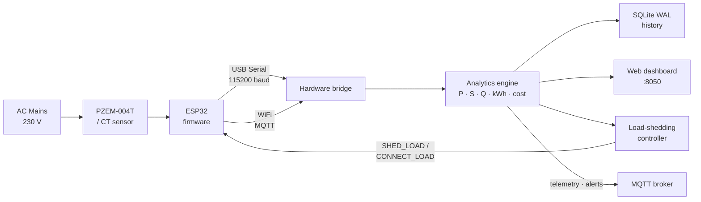

# IoT Smart Energy Monitor

Real-time AC energy monitoring for a single circuit: an ESP32 streams electrical
telemetry, a Python service turns it into power-vector analytics with
time-of-use cost accounting, and an over-threshold load is shed automatically
through a relay.

[](https://github.com/emrefbulut/IoT-Smart-Energy-Monitor/actions/workflows/ci.yml)
[](https://www.python.org/)
[](hardware/esp32_energy_monitor/esp32_energy_monitor.ino)
[](LICENSE)

---

## What it does



The relay command travels back to the same ESP32 that produced the reading, so
the measure → decide → act loop is closed in hardware.

---

## Capabilities

| Area | What is implemented |
| :--- | :--- |
| **Acquisition** | ESP32 firmware emitting JSON telemetry over USB Serial **and** WiFi/MQTT. Both transports carry identical fields and are parsed by the same code path. |
| **Resilience** | Serial reconnect with exponential backoff. A pulled cable no longer strands the process on synthetic data forever. |
| **Analytics** | Active power `P = V·I·PF`, apparent `S = V·I`, reactive `Q = √(S²−P²)`, cumulative kWh, and time-of-use cost. |
| **Cost accounting** | Each sampling interval is priced at the tariff in force **at that moment** and accumulated. Crossing into peak hours never re-prices earlier consumption. |
| **Anomaly detection** | Voltage sag / swell, low power factor, and consumption spikes — all thresholds configurable. |
| **Load shedding** | Automatic relay cut-off above a threshold, with hysteresis, confirmation sampling, and a minimum interval between relay actions. |
| **Messaging** | MQTT publication of telemetry, alerts, and load-shedding events. Optional device-telemetry ingest over MQTT. |
| **Storage** | Non-blocking SQLite writer in WAL mode with indexed queries and CSV export. |
| **Dashboard** | Threaded HTTP server on `127.0.0.1:8050` with live values, history, and an alert feed. |

Simulated samples are flagged `is_simulated` everywhere they appear — in the
database, on the dashboard, and in MQTT payloads — so emulator output is never
mistaken for a measurement.

---

## Quick start

```powershell
python -m venv .venv
.\.venv\Scripts\Activate.ps1
python -m pip install -U pip
python -m pip install -e .
```

Run the monitor and dashboard:

```powershell
smart-energy run
```

Without hardware attached the bridge falls back to a synthetic generator, so the
full pipeline is explorable on a laptop. Dashboard: `http://localhost:8050`.

| Command | Purpose |
| :--- | :--- |
| `smart-energy run` | Acquisition, analytics, dashboard, MQTT, load shedding |
| `smart-energy status` | Print the resolved configuration |
| `smart-energy report --limit 20` | Recent telemetry from the database |
| `smart-energy export-csv --output logs/report.csv` | Export stored telemetry |

---

## Hardware

Wiring diagram, component list, and safety notes:
[`docs/iot_energy_hardware_guide.md`](docs/iot_energy_hardware_guide.md).

> ⚠️ This project touches AC mains. Use a PZEM-004T or an isolated CT sensor,
> never probe live conductors directly, and keep the low-voltage side isolated.

Flash [`hardware/esp32_energy_monitor/esp32_energy_monitor.ino`](hardware/esp32_energy_monitor/esp32_energy_monitor.ino).

**Serial only** (default) — nothing to configure; the firmware streams JSON at
115200 baud.

**WiFi + MQTT** — fill in the credentials at the top of the sketch and install
the `PubSubClient` library:

```cpp
const char *WIFI_SSID     = "your-network";
const char *WIFI_PASSWORD = "your-password";
const char *MQTT_HOST     = "192.168.1.10";
```

WiFi is additive, not a replacement: Serial output continues regardless, and if
the network or broker is unreachable the firmware retries in the background
without ever blocking the sampling loop.

---

## Configuration

All behaviour is driven by [`config/energy_default.yaml`](config/energy_default.yaml).
The two sections most worth understanding:

```yaml
load_shedding:
  enabled: false
  shed_threshold_kw: 3.0      # cut above this
  restore_threshold_kw: 2.0   # restore below this
  confirm_samples: 3          # consecutive readings required to act
  min_action_interval_seconds: 30.0
```

`restore_threshold_kw` must be lower than `shed_threshold_kw` — the gap is the
hysteresis band. With a single threshold, consumption hovering around it would
toggle the relay several times a second and wear it out mechanically. The
confirmation window exists for a different reason: a motor start draws a brief
surge that should not shed the load. The controller refuses a configuration
without hysteresis rather than failing subtly at runtime.

```yaml
mqtt:
  enabled: false
  base_topic: "smart-energy"
  ingest_device_samples: false   # take readings from MQTT instead of Serial
```

| Topic | Direction | Payload |
| :--- | :--- | :--- |
| `{base}/telemetry` | published | Processed sample with power vectors, kWh, cost |
| `{base}/alerts` | published | Anomalies with the reading that triggered them |
| `{base}/load-shedding` | published | `SHED` / `RESTORE` events with the deciding power |
| `{base}/device/telemetry` | consumed | Raw ESP32 readings over WiFi |
| `{base}/device/commands` | consumed by device | Relay commands |

MQTT is optional. With `enabled: false`, or with `paho-mqtt` not installed, every
call becomes a no-op and the application runs exactly as before.

```powershell
python -m pip install -e ".[mqtt]"
```

---

## Testing

```powershell
python -m pip install -e ".[dev]"
pytest tests/ -v
```

The suite covers tariff-boundary cost accounting, the load-shedding state
machine (hysteresis, confirmation, minimum interval, invalid configuration),
MQTT topic derivation and payload construction, and the guarantee that the
Serial and WiFi transports produce identical samples. No test needs hardware,
a broker, or a network — the clock is injected and the message layer is
separated from payload construction.

CI runs the same suite on Python 3.10 and 3.12 for every push and pull request.

---

## License

MIT — see [LICENSE](LICENSE).
